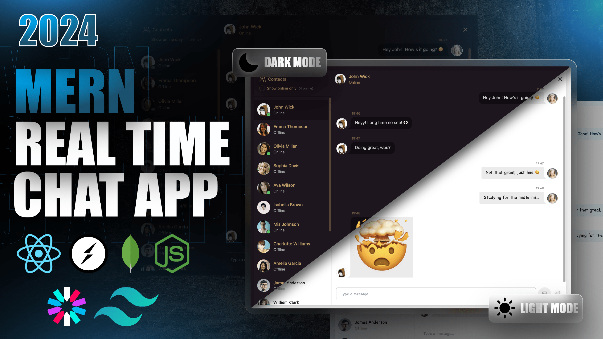

# **✨ Full Stack Realtime Chat App ✨**  

  
 

## **🚀 Highlights**  

- 🌟 **Tech stack:** MERN + Socket.io + TailwindCSS + Daisy UI  
- 🔐 **Authentication & Authorization:** Secured with JWT  
- 💬 **Real-time Messaging:** Powered by Socket.io  
- 🟢 **Online User Status:** Instantly updates when users go online/offline  
- 🛠 **Global State Management:** Managed efficiently with Zustand  
- 🐞 **Error Handling:** Robust error handling on both client & server  
- 🚀 **Deployment:** Deploy like a pro for **FREE**  
- ⏳ **And much more!**  

---

## **🔧 Setup `.env` File**  

Create a `.env` file in your root directory and add the following variables:  

```env
MONGODB_URI=your_mongodb_connection_string
PORT=5001
JWT_SECRET=your_jwt_secret

CLOUDINARY_CLOUD_NAME=your_cloudinary_name
CLOUDINARY_API_KEY=your_cloudinary_api_key
CLOUDINARY_API_SECRET=your_cloudinary_api_secret

NODE_ENV=development
```

---

## **📦 Build the App**  

Run the following command to build the app:  

```sh
npm run build
```

---

## **🚀 Start the App**  

To start the application, run:  

```sh
npm start
```